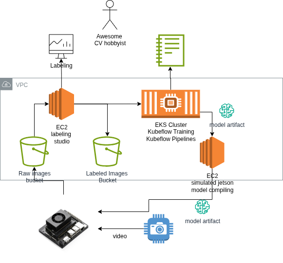

# OODA Lib

Manage your full training, deploying, and measuring lifecyle for homebrew computer vision projects on Nvidia Jetson nano. 
Low cost is a top concern across all solution choices. To achieve this, we share compute when available and avoid platform as a service. 

## Persisting
* Save video data to the cloud in a cost-optimized way

## Labeling
* Implement your favorite labeling software (Voxel51, CVAT) on a low-cost ec2 instance. Only pay while using

## Training & Experimentation
* Train using Kubeflow train, preconfigured to access your labeled training data

## Test Model
* Publish artifact to low-cost ec2 instance with jetson nano emulator and run test suite

## Deploy
* Automatically deploy the optimized and tested artifact to your Jetson

## Future Work
* AgentOps workflow for 
* Auto-labeling for self-supervised learning