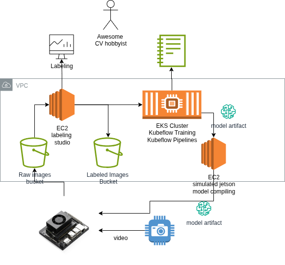

# Cloud Via AWS

## To Deploy
First, install [terraform CLI](https://developer.hashicorp.com/terraform/cli/commands) and create default AWS authentication. 

#### 1. Deploy to Account 
`terraform init && terraform apply`

#### 2. Remove assets
`terraform destroy` 
*Note* -  AWS S3 Buckets with contents must be emptied and deleted manually from the console

## Design



## Services & Assets

### Upload Service
Uploads video files from edge device into an S3 bucket. 

#### Assets
* S3 bucket - holds raw processed video
* Iam Role - allows write access to s3 from edge device

### Labeling Service

#### Assets
* S3 bucket - holds labeled training data
* Ec2 instance - runs labeling software
* Iam role - labeling role

### Training Service
* EKS Cluster - training and experimentation notebooks
* EFS Volume - holds training data

#### Release Service
* EC2 instance - EC2 instance with Jetson Nano emulator to test model before production


## Organization

The terraform assets are organized by domain, to allow users to easily deploy the capabilities they need, and refrain from what they don't. Below is the folder organization:

```
aws/
|--upload/ 
    |--s3.tf
        |--ooda-raw-video-<acct_id>
    |--iam.tf
        |--ooda_edge_role-<acct_id>

|--labeling/
    |--s3.tf
        |--ooda-processed-video-<acct_id>
    |--ec2.tf 
        |--ooda_labeling
    |--iam.tf
        |--ooda_labeling_role
    |--startup_script.sh

|--training/
    |--eks.tf
        |--ooda_kubeflow
    |--efs.tf
        |--ooda_fs
    |--kubeflow_install.sh

|--release/
    |--ec2.tf
        |--ooda_jetson_sim
    |--iam.tf

|--monitoring/
    |--cloudwatch.tf
        |--ooda_upload_service_down_alarm
    |--grafana.tf
        |--ooda_managed_grafana
     
```